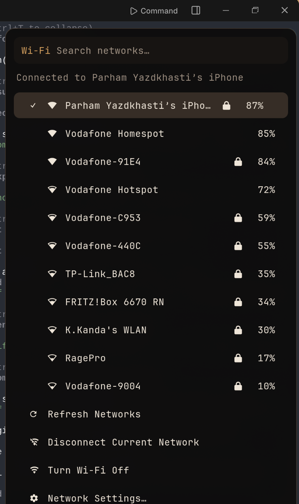
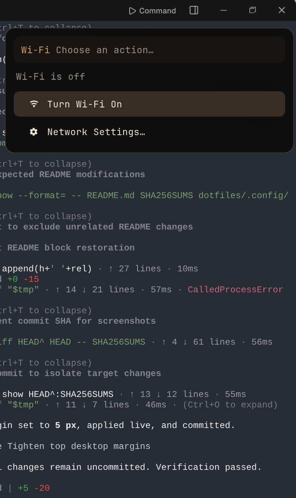

# Custom Linux — Hyprland/Waybar State Snapshot

A portable, sanitized snapshot of the current desktop configuration on a Fedora Asahi Remix system. It captures the **configuration and reproducibility metadata**, not the base operating-system files.

Snapshot created: `2026-08-13T09:36:52+02:00`

## Current appearance settings

| Setting | Value |
|---|---:|
| Desktop compositor | Hyprland 0.56.0 |
| Bar | Waybar 0.15.0 |
| Waybar rendered height | **30 px** (about 80% of the original 38 px) |
| Waybar top/side margins | 5 px / 10 px |
| Text size | 12 px |
| Network icon/text size | 14 px |
| Tray icon size | 16 px |
| Hyprland inner gap | **4 px** |
| Hyprland outer gap | **4 px** |
| Display | 2560×1664 @ 60 Hz, scale 1.6 |
| Active theme | `obsidian-ember` |

The bar retains its readable text/icon sizes and horizontal widths. Only its vertical geometry was compacted. The top bar margin is 5 px, while the outer and inner window gaps are both 4 px.

## Repository contents

```text
dotfiles/
  .config/
    hypr/             Hyprland configuration
    waybar/           Waybar configuration and CSS
    kitty/            Terminal configuration
    btop/             System monitor theme/configuration
    rofi/              Menus and flyouts
    mako/              Notification styling
    obsidian-ember/    Theme palettes, templates, and wallpapers
    systemd/user/      Custom desktop-related user units
  .local/bin/          Custom `obsidian-*` desktop utilities
  .local/state/        Whitelisted theme selection only
manifests/
  rpm-installed.tsv             Exact installed RPM inventory
  dnf-userinstalled.txt         DNF user-installed package inventory
  flatpak-installed.tsv         Flatpak inventory
  font-families.txt             Available font families
  *-services-enabled.txt        Enabled unit names
  wallpapers.sha256             Wallpaper integrity checksums
  system-summary.txt            Sanitized system summary
screenshots/
  wifi-menu-*.png               Wi-Fi dropdown reference screenshots
scripts/
  restore-config.sh             Safe configuration restore helper
  iphone-usb-tether.sh          Connect iPhone internet over USB only
  verify-snapshot.sh            Integrity and secret-pattern checks
```

## Restore the configuration

Review the files first, then run:

```bash
git clone https://github.com/parham-yz/Custom_Linux.git
cd Custom_Linux
./scripts/restore-config.sh --apply
```

The restore script:

1. creates timestamped backups for overwritten files;
2. copies only the tracked configuration files into `$HOME`;
3. restores the selected wallpaper path portably;
4. reloads systemd user units and the running Hyprland/Waybar session when available.

It does **not** install packages or enable services automatically. Use the manifests to compare the target machine before installing anything:

```bash
comm -23   <(cut -f1 manifests/rpm-installed.tsv | sort -u)   <(rpm -qa --qf '%{NAME}\n' | sort -u)
```

Flatpak applications can be reviewed with:

```bash
cat manifests/flatpak-installed.tsv
```


## Native AI coding agent

This desktop now includes an Omarchy 4-style native agent layer. It has a default
agent picker, lazy per-user installs, a dedicated launch shortcut, Waybar usage
status, a Rofi dashboard, OS-aware skills, and private click-to-diagnose crash
handoff. Press `Super+Shift+Ctrl+A`, open **OMA › AI Agents**, or run:

```bash
obsidian agent pick
```

Approval defaults to `ask`, and authenticated usage checks default to off;
Omarchy-style automatic approval and provider network checks are separate
opt-ins. See [AI_AGENT_INTEGRATION.md](AI_AGENT_INTEGRATION.md) for usage, privacy details,
provider limits, tests, and the official research sources.

## Wi-Fi dropdown

Click the persistent Wi-Fi icon in Waybar to open the custom network menu. The
menu keeps the current network selected, sorts nearby networks by signal,
supports search, refresh, disconnect, radio on/off, saved credentials, and a
password prompt for new secured networks. Destructive actions are below the
network list, and free-form menu input cannot accidentally trigger an action.

| Wi-Fi enabled | Wi-Fi disabled |
|---|---|
|  |  |

## Bluetooth controls

The Bluetooth icon next to Wi-Fi reflects controller and connection state.
Left-click opens a matching Rofi device manager. It supports power control,
nearby-device scanning, pairing and trust authorization, connect/disconnect,
forgetting devices, battery display when BlueZ provides it, and direct audio
settings. Middle-click scans and refreshes the menu; right-click toggles power.
Headphones and headsets use the installed PipeWire/WirePlumber A2DP and HFP/HSP
profiles. PIN or passkey devices fall back to an interactive pairing terminal.

## iPhone USB-only tethering

Connect and unlock the iPhone, enable **Settings → Personal Hotspot → Allow
Others to Join**, accept the Trust prompt when requested, then run:

```bash
./scripts/iphone-usb-tether.sh
```

On Fedora, the script installs `libimobiledevice-utils` if needed, pairs the
iPhone, connects its `ipheth` Ethernet interface through NetworkManager, tests
connectivity, and disables Wi-Fi so traffic uses only the USB cable. To leave
Wi-Fi enabled, pass `--keep-wifi`. To turn Wi-Fi back on later:

```bash
./scripts/iphone-usb-tether.sh --wifi-on
```

## Privacy and scope

The snapshot intentionally excludes:

- `/usr`, `/bin`, system libraries, kernels, firmware, and other base OS files;
- browser profiles, SSH/GPG keys, Git credentials, API keys, and environment files;
- network profiles and saved Wi-Fi passwords;
- clipboard history, logs, caches, PIDs, and personal documents;
- unrelated application/service configuration.

Only the whitelisted `current-theme` state is included from local state. Absolute home paths in the wallpaper selection are converted to a portable relative path.

## Compatibility

The configuration is tailored to Fedora Asahi Remix on Apple Silicon and a 2560×1664 internal display. Most dotfiles can be reused on other Hyprland systems, but package names, monitor scaling, power controls, brightness controls, and Apple-specific key bindings may require adjustment.

## Verify

```bash
./scripts/test-agent-integration.sh
./scripts/verify-snapshot.sh
```

The first command tests the native AI layer in an isolated home directory. The
second checks file hashes and scans tracked text for common secret patterns. The authoritative integrity list is `SHA256SUMS`.
