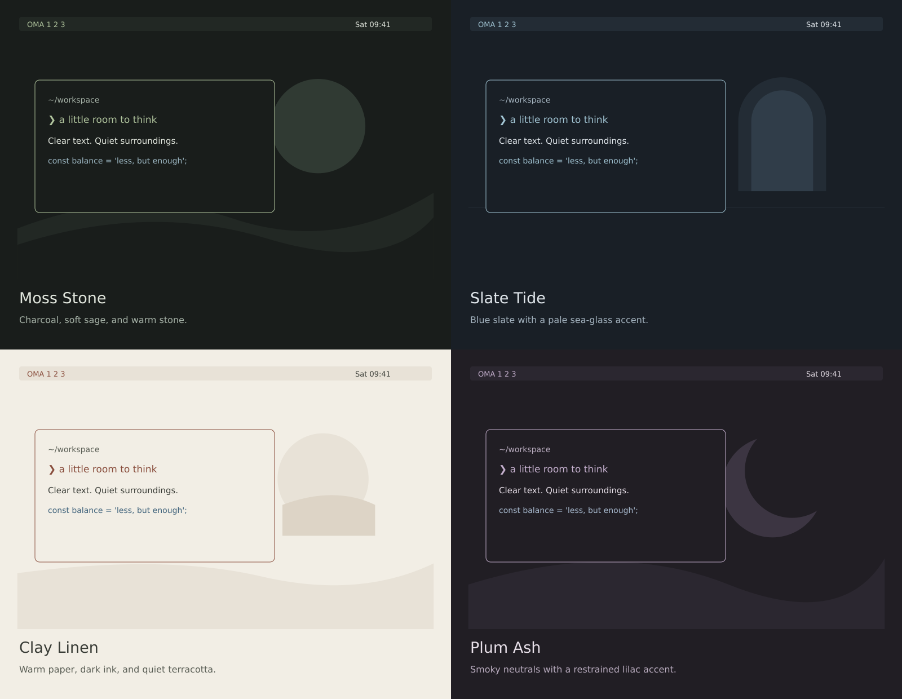

# Quiet desktop themes

Four original themes extend this desktop's existing palette system. Each uses
one accent family, related neutral surfaces, and a matching 2560×1664 wallpaper.
The geometric wallpapers are original SVG artwork, with PNG copies for swaybg.



Open [the interactive gallery](themes.html) to compare palettes. The previews
illustrate the colors; the installed desktop keeps its current bar modules,
window spacing, font sizes, and keyboard shortcuts.

| Theme | Appearance | Command |
|---|---|---|
| Moss Stone | Charcoal and muted sage | `obsidian-theme set moss-stone` |
| Slate Tide | Blue slate and sea glass | `obsidian-theme set slate-tide` |
| Clay Linen | Warm paper and terracotta; light | `obsidian-theme set clay-linen` |
| Plum Ash | Smoky charcoal and muted lilac | `obsidian-theme set plum-ash` |

Colors follow the selection across Hyprland borders, Waybar, Rofi menus, Kitty,
Mako notifications, btop, and Starship. Kitty uses an opaque background for these
four themes. Existing themes retain their previous 0.92 terminal opacity.
New Kitty windows load the selected palette; already-open terminals may need
their configuration reloaded with Kitty's `Ctrl+Shift+F5` shortcut.
Apps with their own theme systems, such as browsers and Orca, retain their own
appearance settings.

## Install and switch

From this repository, preview the scoped installation:

```bash
python3 scripts/install-minimal-themes.py
```

Install the collection and activate Moss Stone:

```bash
python3 scripts/install-minimal-themes.py --apply --theme moss-stone
```

Omit `--theme moss-stone` to keep the current selection. The installer copies
only the four theme directories, the theme switcher, and the Kitty color
template. It checks for unrelated local edits to the latter two files before
writing. Replaced files and the previous active theme state are backed up under
`~/.local/state/custom-linux-backups/minimal-themes-<timestamp>/`.

Use **Super+Ctrl+Shift+Space** for the existing theme picker. To return to the
previous Obsidian Ember appearance:

```bash
obsidian-theme set obsidian-ember
```

## Design and verification

The [research notes](theme_design_research.md) document the sources: Omarchy's
shared palette/template approach, Carbon's restrained use of color, and W3C's
contrast calculation. These themes adapt those ideas to the existing Fedora
desktop; they do not install Omarchy.

Primary text contrast against the solid background ranges from **9.83:1 to
13.31:1**. Tested secondary text, selected labels, and accent-fill text reach
at least **4.5:1**. The test also checks terminal colors 1–15 on the terminal
background. ANSI color 0 remains the conventional dark/base slot. These are
color-pair checks, not a claim of complete desktop accessibility. Translucent
menus and the bar can vary with the wallpaper behind them.

```bash
python3 scripts/test-minimal-themes.py
./scripts/verify-snapshot.sh
```

The first command renders all seven themes with the real switcher in a temporary
home. Desktop reload commands are stubbed so it does not change the live session.
It verifies wallpaper selection, state, template replacement, Starship TOML,
and both new and existing terminal opacity behavior.

To edit the palettes or artwork, change `scripts/build-minimal-themes.py`, then
run it again. Building requires Python 3 and `rsvg-convert`; installing the
prebuilt themes needs only Python 3 and the desktop's existing tools.
