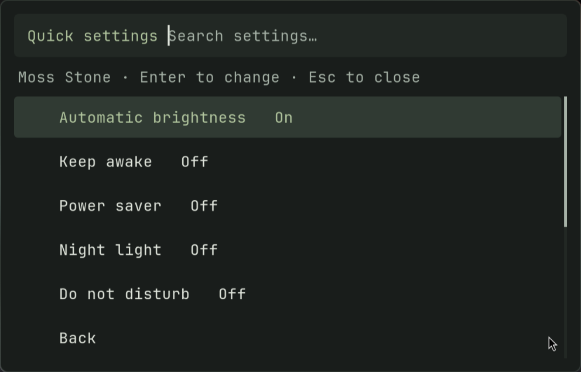
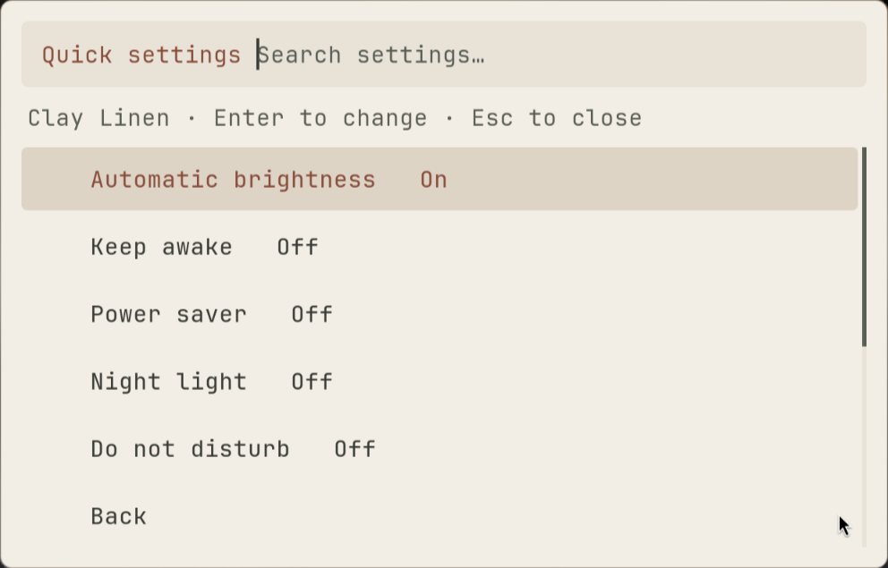
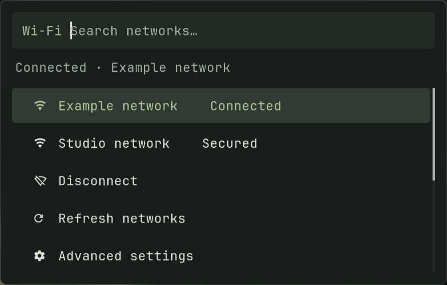
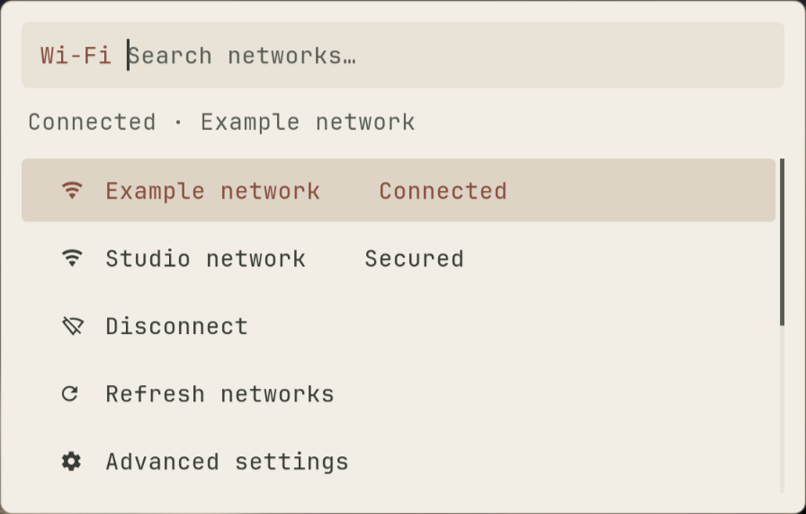
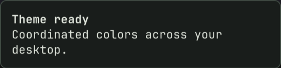
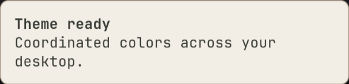

# Desktop polish

The September 2026 pass brings quieter surfaces, clearer menu navigation, and more reliable feedback to the existing Hyprland, Waybar, and Rofi desktop. Omarchy informed the menu hierarchy, grouped bar controls, and contextual indicators. The [source review](ui_ux_research.md) records the references and initial findings.

## Appearance and interaction

- The bar uses two grouped surfaces, consistent spacing, and subdued ordinary states. Recording, Do Not Disturb, and keep-awake indicators appear when relevant. Tooltips explain click and scroll actions.
- Menus have opaque backgrounds, readable selection colors, contextual search prompts, and Back entries. The main menu fits all eleven sections. Quick settings show current states and refresh after a toggle; Escape closes without action.
- Themes coordinate notifications, volume/brightness feedback, screenshot selection, and screen locking. OSDs show a percentage or mute state, replace earlier feedback, stay out of notification history, and remain visible during Do Not Disturb.
- All seven palettes pass the tested 4.5:1 semantic text contrast pairs. The four newer themes retain their existing high-contrast terminal palettes. Theme changes reload running Kitty windows.
- Theme and wallpaper pickers show readable names and wallpaper thumbnails. Existing window gaps, monitor scaling, and notch clearance are preserved; disabling and restoring gaps returns their observed dimensions.

| Dark: Moss Stone | Light: Clay Linen |
|---|---|
|  |  |
|  |  |
|  |  |
|  |  |

These are native rendered panels; quick-setting rows, device names, and notification contents are fixtures. The [main menu preview](screenshots/ui-polish/main-menu.png) shows the installed menu.

## Behavior fixes

Recording controls no longer stop a recording merely by opening. Startup checks confirm the recorder survives; stopping verifies process identity, waits for finalization, and checks the output before reporting success. A visible bar indicator links back to recording controls. The local recorder's incompatible FFmpeg libraries were repaired with Fedora's native ARM64 `wf-recorder` 0.6.0 binary; its installer now validates library resolution before replacing a working executable.

Reminder cleanup stops the actual timer and service, reports failures, and accepts decimal durations such as `08`. Clipboard menus exclude watcher state. Unlisted menu input cannot trigger an action, and cancelled power confirmations do nothing. Update checks distinguish failure from an up-to-date system; offline weather has a clean empty state. Agent diagnostics remain visible in their terminal.

## Install and recovery

```bash
python3 scripts/install-ui-polish.py          # Preview and check for local edits
python3 scripts/install-ui-polish.py --apply  # Back up, install, preserve active theme
```

The installer manages an explicit 31-file manifest. It stops before writing if a destination has unrecognized edits, backs up existing and generated files under `~/.local/state/custom-linux-backups/ui-polish-*`, then regenerates the current theme. `previously-absent.json` records files that did not exist before installation. Review the relevant backup before restoring files, then run `obsidian-theme restore` to regenerate their theme outputs.

The initial backup for this pass is `ui-polish-20260905_130346_994267`; subsequent backups hold intermediate refinements. The separate recorder backup is `recorder-repair-20260905_130347/wf-recorder`. Binary repair is not part of the UI installer; `obsidian-install-wf-recorder` provides the validated native-package extraction route when needed.

The live desktop remains on **Moss Stone**. The portable snapshot retains **Obsidian Ember** as its saved default, rendered from the same updated templates.

## Verification

```bash
python3 scripts/test-desktop-ui.py
python3 scripts/test-minimal-themes.py
./scripts/test-agent-integration.sh
./scripts/test-bluetooth-integration.sh
./scripts/verify-snapshot.sh
```

Interaction tests use an isolated home and mocked power, audio, notification, and service commands. They cover selection, Back, Escape, cancelled confirmation, reminder failures, clipboard state, gap restoration, theme-aware lock arguments, recorder startup failure, active status, and verified stopping. All seven themes render through the real switcher.

Native Rofi parsing and dark/light menu, device-panel, notification, and OSD rendering were checked on the desktop. A three-second silent capture of a small bar region produced a valid H.264 video. Microphone recording, real locking/suspending, package upgrades, and connectivity changes were not executed during verification.

## Wi-Fi and Bluetooth mouse dismissal

Both bar dropdowns close when clicking outside them or clicking their bar icon again. Rows activate with one mouse click; clicking the search entry keeps the menu open, and Escape still cancels. Bluetooth status queries now return immediately after completing, while an external timeout still bounds hung commands. The disabled-state tooltips describe the menu that actually opens.

Rofi 2.0 advertises `-click-to-exit`, but its [release notes](https://github.com/davatorium/rofi/releases/tag/2.0.0) document that it does not work on Wayland. The shared device theme therefore uses a transparent fullscreen surface with cancellation buttons around a compact panel. This follows the same surface-capture principle as [upstream's later Wayland fix](https://github.com/davatorium/rofi/pull/2272), using [Rofi's supported button actions](https://davatorium.github.io/rofi/current/rofi-theme.5/#button). Each wrapper supplies the initial row count because Rofi 2.0 does not resize the nested list naturally in this layout. The surface covers the current display and consumes the dismissing click.

Run the optional native interaction check while the desktop is idle:

```bash
python3 scripts/test-connectivity-ui.py --live-desktop
```

It opens example panels through the actual Wi-Fi/Bluetooth helpers and Rofi, injects pointer and keyboard events through Wayland, and restores the pointer afterward. Network, Bluetooth, notification, and settings commands are mocked. Sixteen checks cover all four outside regions, inside search and single-click selection, Escape, keyboard selection, and repeat-icon dismissal; they also check that cancellation does not toggle either radio. The old theme fails the outside-click assertion. The real bar icons were additionally checked twice per dismissal method: each opened in approximately 0.2 seconds. Connections and pairings were not changed.

The live installation backup for this fix is `~/.local/state/custom-linux-backups/ui-polish-20260905_134714_008814`.
